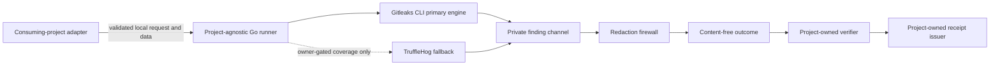
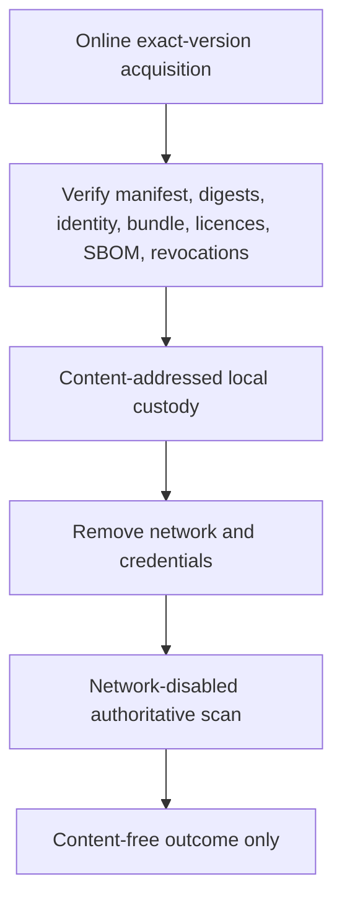
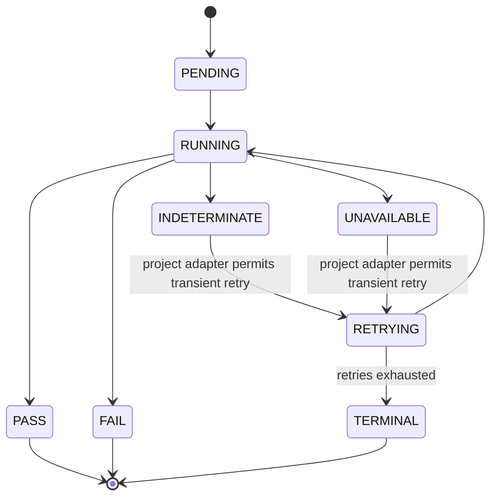

# Product Architecture

## Status and scope

This document defines the target architecture required by PASS-SPEC-001. It is
planning authority, not proof that any component exists. PSCAN-01 implements no
product code, schema, workflow, engine, or release asset.

## Product context

The scanner boundary ends at the content-free outcome. A consuming project
owns request construction, retries, policy and allowlist authority, receipt
issuance and verification, revocations, evidence custody, merge and deployment
gates, credential response, retention, and go-live decisions.

## Acquisition and execution separation

No scan starts until acquisition verification succeeds. Scan execution has no
network, update channel, telemetry, provider verification, credentials, or
write-capable repository token.

## Logical components and responsibility boundaries

| Component | Owns | Must not own |
|---|---|---|
| CLI entry point | Non-interactive invocation, one outcome object, exit mapping | Findings, retry scheduling, CI-provider behavior |
| Request validator | Schema, version, freshness, digest and path validation before scan | Project policy authorship |
| Workspace manager | Fresh per-project/per-attempt workspace, safe mounts, resource bounds, destruction | Shared project cache or persistent findings |
| Git input preparer | Safe exact range/tree preparation with hostile Git features disabled | Candidate execution or dependency installation |
| Artifact normalizer | Safe deterministic archive/OCI expansion and explicit limit rejection | Silent skip, archive execution, unsafe extraction |
| Engine orchestrator | Exact adapter selection, pinned binding verification, argument-array subprocesses | Shell interpolation or direct upstream resolution |
| Gitleaks adapter | Exact primary-engine Git and file scans with private capture | Gitleaks GitHub Action or raw external output |
| TruffleHog adapter | Compile/request-time disabled boundary reserved for an approved gap | Binary distribution or execution before PSCAN-08 eligibility and approval |
| Policy evaluator | Mandatory invariants, global revocations, project-policy projection, exception evaluation | Project policy/allowlist authority or manual pass conversion |
| Redaction firewall | Remove secret values and forbidden metadata on every output/error/crash path | Remediation disclosure in ordinary CI |
| Outcome classifier | Stable content-free state, reason, bindings, coverage and action | Finding details, merge or deployment authority |
| Cleanup controller | Destruction after pass, fail, timeout, cancellation and crash | Durable per-finding storage |
| Release verifier | Offline release identity, signature bundle, manifest, digest, licence, SBOM and revocation checks | Networked scan execution |
| Reference chain verifier | Custody-neutral verification of project-owned evidence-chain formats | Project evidence storage or receipt keys |

## Trust boundaries

### TB-1: Untrusted candidate to preparation

Candidate bytes, paths, archives, Git metadata, configuration, attributes and
messages are hostile data. They never control a shell, workflow definition,
dependency installation, executable path, output format, or policy authority.

### TB-2: Prepared input to engine subprocess

The runner supplies read-only local paths and bounded settings through argument
arrays. Executables, rules and adapters are digest-bound trusted assets. Safe
Git configuration disables inherited config, hooks, filters, pagers, external
diffs and text conversion.

### TB-3: Engine output to private finding channel

All stdout, stderr, malformed output, exceptions and crash material are
captured privately. Nothing reaches an external surface before the redaction
firewall proves removal of secret values and forbidden metadata.

### TB-4: Outcome to consuming project

Only approved state, reason code, binding digests, versions, attempt metadata,
duration, completed coverage classes and permitted action cross the boundary.
A pass is evidence for exact bindings only.

### TB-5: Public release trust to project receipt trust

Cosign keyless public scanner-release identity is distinct from every
project-owned receipt trust root. The scanner never receives a project receipt
key, issues a receipt, or promotes a release.

### TB-6: Project-to-project isolation

Projects share only signed scanner releases, generic rules, public scanner
schemas, synthetic fixtures, compatibility notices and global scanner-release
revocations. Workspaces, source, findings, paths, identities, policies,
allowlists, caches, receipts, keys, evidence and statistics never cross.

## Fail-closed state flow

Invalid request, unsupported schema, missing or changed binding, incomplete
coverage, unsafe input, resource limit, engine conflict, integrity failure,
redaction uncertainty, timeout or cleanup uncertainty can never produce pass.

## Cross-platform contract

Windows amd64 and Linux amd64 implement the same logical request, outcome,
reason-code, redaction and coverage semantics. Platform-specific path and
sandbox mechanics are internal. Additional architectures are unsupported until
they pass equivalent acceptance.

## Architecture invariants

1. The scanner remains project-independent and CI-provider neutral.
2. Candidate-controlled material is never executable syntax.
3. Gitleaks is the pinned primary engine.
4. TruffleHog is absent and disabled until the PSCAN-08 evidence and owner gates
   are both satisfied.
5. Authoritative scanning is network-disabled and credential-free.
6. All findings remain transient; there is no durable per-finding database.
7. Every external result is content-free.
8. Every binding is exact, versioned and digest-bound.
9. Every unsupported or unproven condition is non-pass.
10. Public release trust and project receipt trust remain separate.
11. No scanner result grants merge, deployment, production, legal or go-live
    authority.
