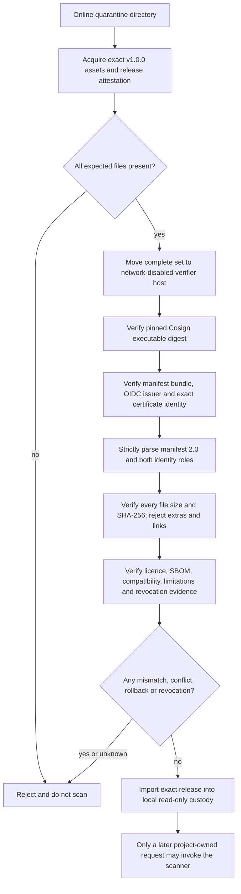
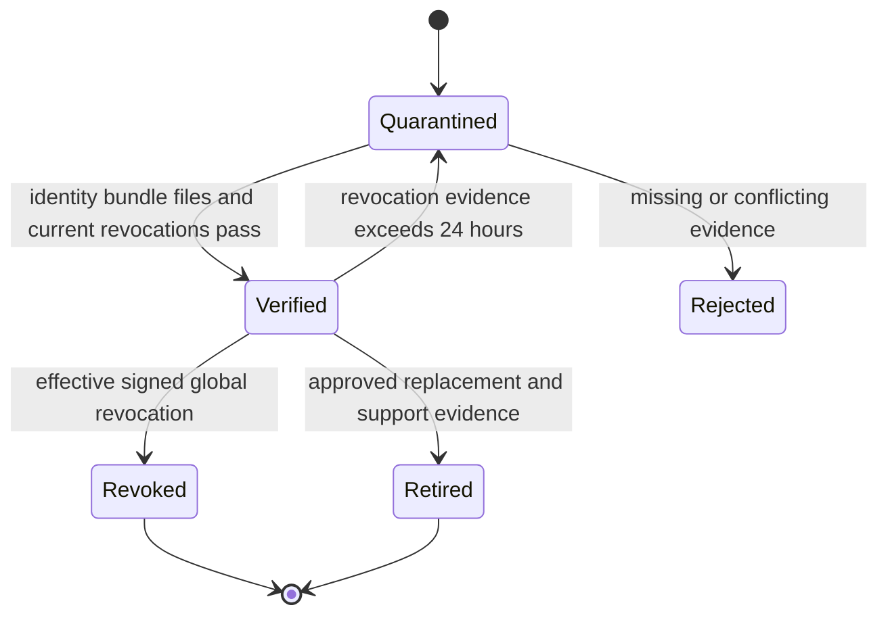

# Offline Release Acquisition and Verification Runbook

This is the operator contract for acquiring and verifying the exact public
scanner release. A release is unusable until every step succeeds. Missing,
stale, conflicting, untrusted or unsupported evidence is a rejection.
Verification never invokes the scanner or reads a candidate repository.
The complete scanner CLI, request payload, outcome payload, exit mapping and
execution state diagrams are in `docs/release/SCANNER-IO-REFERENCE.md` and are
part of the release documentation bundle.

## Fixed trust policy for v1.0.0

| Binding | Required value |
|---|---|
| Repository | `ThameeraDananjaya/project-agnostic-secret-scanner` |
| Repository owner ID | `50274860` |
| Product source | tag `v1.0.0`; commit `a13c28fe7273bc8dc6545f97966a02889524eb4c`; tree `217b711ddea51fd0ea7e808edd2e27fdecef8427` |
| Release tooling | tag `release-tooling-v1.0.0-c1`; exact accepted commit/tree embedded in the verifier and manifest |
| Workflow | `.github/workflows/release-recovery-v1.0.0.yml` |
| Workflow ref and trigger | `refs/tags/release-tooling-v1.0.0-c1`; `workflow_dispatch` |
| Workflow SHA | exact accepted correction-tooling commit; must equal the manifest tooling commit |
| Release | `v1.0.0` |
| OIDC issuer | `https://token.actions.githubusercontent.com` |
| Certificate identity | `https://github.com/ThameeraDananjaya/project-agnostic-secret-scanner/.github/workflows/release-recovery-v1.0.0.yml@refs/tags/release-tooling-v1.0.0-c1` |
| Manifest schema | `scanner-release-manifest` `2.0` |
| Cosign | `v3.1.3`; Linux amd64 SHA-256 `4629c757b7618056f8ddd7e2625ae9fdd94c0372a65049520bc7d9df9efc7f71`; Windows amd64 SHA-256 `9fe59be0eca1271873ce019061335eb1ac419b7059202e797828467ddabe33be` |

Names do not substitute for numeric identity. The repository ID and observed
workflow claims must also be recorded during the remote preflight because the
repository does not exist at PSCAN-06 local implementation time.

## Trust flow



## Online acquisition

1. Create a new empty quarantine directory. Never reuse a directory that held
   another version.
2. Fetch release `v1.0.0` by exact tag, never `latest`, a branch, an auto-update
   channel or GitHub-generated source archives.
3. Download every asset: manifest, bundle, platform bundles, runners, engines,
   verifiers, rules, schemas, checksums, licences/notices, licence manifest,
   SBOM, test summary, compatibility, limitations, build provenance and
   revocation evidence.
4. Verify the immutable GitHub release attestation and record repository ID,
   tag, commit and asset list. If immutability is disabled or read-back differs,
   stop.
5. Download Cosign only from exact release `v3.1.3` and verify the platform
   SHA-256 above before execution.
6. While still online, run pinned Cosign
   `trusted-root create --with-default-services --out trusted-root.json`. This
   authenticates current Sigstore trust material through Cosign's TUF root.
   Record the trusted-root SHA-256 independently and keep the file outside the
   release directory. The 2026-09-03 preflight example was
   `844a1c6de3986c9f02070266b25e0d1a2fa99ceccc89f6b9ad90aae47b62a16e`;
   do not assume it remains current after rotation.
7. Copy the complete release directory, pinned Cosign executable, trusted-root
   file and its separately recorded digest to a network-disabled host. Never
   copy credentials or repository content there.

```powershell
gh release download v1.0.0 --repo ThameeraDananjaya/project-agnostic-secret-scanner --dir C:\quarantine\pscan-v1.0.0
gh release verify v1.0.0 --repo ThameeraDananjaya/project-agnostic-secret-scanner
```

```bash
gh release download v1.0.0 --repo ThameeraDananjaya/project-agnostic-secret-scanner --dir /quarantine/pscan-v1.0.0
gh release verify v1.0.0 --repo ThameeraDananjaya/project-agnostic-secret-scanner
```

## Offline verifier parameters and output

All seven parameters are mandatory in practice; the two relative paths have
fixed defaults.

| Parameter | Type | Meaning and validation |
|---|---|---|
| `--directory` | existing directory | Complete release set. Links, special files, path escape and unexpected files reject. |
| `--manifest` | safe relative path | Default `release-manifest.json`; exact bytes are bundle-verified. |
| `--bundle` | safe relative path | Default `release-manifest.sigstore.json`; absence or mutation rejects. |
| `--cosign` | existing regular file | Absolute path to separately acquired pinned Cosign; links reject. |
| `--cosign-sha256` | 64 lowercase hex | Must equal the platform digest above and current executable bytes. |
| `--trusted-root` | existing regular file outside release directory | Sigstore trusted-root JSON acquired through pinned Cosign/TUF during online quarantine. Links reject. |
| `--trusted-root-sha256` | 64 lowercase hex | Independently recorded digest from the authenticated online acquisition; current bytes must match. |

```powershell
.\scanner-release-verifier-windows-amd64.exe --directory C:\quarantine\pscan-v1.0.0 --cosign C:\quarantine\tools\cosign-windows-amd64.exe --cosign-sha256 9fe59be0eca1271873ce019061335eb1ac419b7059202e797828467ddabe33be --trusted-root C:\quarantine\trust\trusted-root.json --trusted-root-sha256 <recorded-64-lowercase-hex>
```

```bash
./scanner-release-verifier-linux-amd64 --directory /quarantine/pscan-v1.0.0 --cosign /quarantine/tools/cosign-linux-amd64 --cosign-sha256 4629c757b7618056f8ddd7e2625ae9fdd94c0372a65049520bc7d9df9efc7f71 --trusted-root /quarantine/trust/trusted-root.json --trusted-root-sha256 <recorded-64-lowercase-hex>
```

Success is exactly one content-free line:

```text
verified release=v1.0.0 manifest_sha256=<64 lowercase hex> assets=<decimal count>
```

Exit `0` means verification completed. Exit `40` and the generic stderr message
mean reject. Any other exit, partial output, missing line or manually ignored
warning is not a pass. Output never contains file contents, signatures,
credentials, findings or candidate data.

## Release-manifest 2.0 payload

| Field | Type | Bound meaning |
|---|---|---|
| `schemaFamily`, `manifestSchemaVersion` | strings | Exact family and `2.0`; unknown/duplicate members reject. |
| `releaseVersion` | semver tag | Exact product release `v1.0.0`; it is not the workflow ref. |
| `productSource` | tag/commit/tree object | Exact immutable `v1.0.0` product role. |
| `releaseTooling` | tag/commit/tree/workflow/ref/SHA/trigger object | Exact immutable correction-tooling role. Workflow SHA must equal the tooling commit. |
| `runnerVersion`, `goToolchainVersion` | versions | Runner `1.0.0` and exact Go patch. |
| `runnerBindings[]` | two platform digests | One Windows amd64 and one Linux amd64 path and SHA-256. |
| `engineBindings[]` | two engine objects | Gitleaks name, version, source commit, platform, path and SHA-256. |
| `rulePack` | path and SHA-256 | Exact generic rule configuration, never project policy. |
| `schemaBindings[]` | family/version/path/digest | Every scanner-owned shipped schema. |
| `releaseIdentity` | identity object | Repository, numeric owner, recovery workflow, tooling ref, workflow SHA, trigger, issuer and certificate URI. |
| `compatibility` | compatibility object | Platforms and bound test-summary/limitation assets. |
| `revocation` | revocation object | Discovery, bootstrap snapshot/checkpoint, schema and 24-hour refresh rule. Discovery is never trusted by transport alone. |
| `assets[]` | asset objects | Safe path, kind, platform, exact length and SHA-256 for every payload. Manifest and bundle are outside the list to avoid a circular digest; the bundle signs the manifest bytes. |
| `createdAt` | UTC timestamp | Deterministic correction-tooling commit time, not build wall clock. |

Each asset object is exactly:

```json
{"path":"name","kind":"declared-kind","os":"none|linux|windows","arch":"none|amd64","size":1,"sha256":"64-lowercase-hex"}
```

The checksum file covers prior payloads; the signed manifest binds the checksum
file. This avoids checksum/manifest cycles.

Schema `1.0` and `1.1` remain historical supported inputs under their original
single-source rules. They cannot contain the `2.0` identity roles or be relabeled
as `2.0`. The recovery verifier is compiled with the exact accepted tooling
commit/tree; a product/tooling role swap, omission, ambiguity or mutation
rejects before any scanner execution. Cosign verification separately constrains
repository, workflow ref, workflow SHA, trigger, certificate identity and
issuer from the signed certificate claims.

## Revocation, rollback and retirement



- At import, refresh the global revocation chain, accept only signed schema
  `1.1` records in contiguous sequence from the trusted checkpoint, and persist
  the verified head.
- Mutable discovery is navigation only. TLS, HTTP success, release ordering and
  `latest` are never authority. A gap, duplicate, rollback, fork, unknown key,
  invalid signature, stale snapshot or unavailable refresh rejects.
- Effective `scanner-release`, `scanner-asset`, `rule-pack` or `scanner-schema`
  revocation wins over a previous pass.
- For rollback, reacquire an explicitly approved earlier exact version and
  repeat all steps. Never replace files within a verified set.
- For retirement, preserve manifest, bundle, attestations, checksums,
  revocation head and decision evidence. Project cleanup/deployment authority
  remains outside this product.

## Operator record

Record acquisition time; repository numeric ID; immutable-release read-back;
tag/commit; attestation result; every filename/size/hash; Cosign version/hash;
manifest hash; certificate identity/issuer; revocation checkpoint/head and
refresh time; verifier stdout/exit; operator; and final
`ACCEPTED_FOR_LOCAL_CUSTODY` or `REJECTED`. Never record credentials, findings,
candidate bytes, project identity, project policy or receipts here.

## Correction C2 proposed verification addendum

This addendum describes the unaccepted C2 candidate and does not change the C1
instructions above. A C2 release set must use manifest schema `2.1`, proposed
tag/ref `release-tooling-v1.0.0-c2`, the exact accepted C2 commit/tree if one is
later accepted, and certificate identity ending in
`@refs/tags/release-tooling-v1.0.0-c2`. Schema `2.0` remains C1-only.

Before any separately approved remote run, independently verify that the
mandatory admission orchestrator itself completes the host-only cache and CRLF
phases before any Docker command; that admission names only
`docker.io/library/golang@sha256:ded31c68586d2e49e760acc2e65a884b23d032e9bbbed0ae0c55abd3fcaf4452`;
that only an empty exact-reference structured inventory from a separately
proved responsive engine can authorize its single pull; and that a fresh
Docker inspection proves the complete repository-digest set contains exactly
one canonical identity after any pull. Daemon, permission, timeout, protocol,
stderr, malformed, scalar, null, duplicate, alias, mixed or unknown evidence
must stop with no pull or later action. Container cache and shell-parser proofs must
use `--pull=never --network none`. Dependency acquisition is the only networked
build phase, and reproducibility builds must remain network-disabled with the
completed cache read-only.

For iteration 003, verify the admission entrypoint rejects dot-sourcing and has
no callback, script-block, executable, PATH or environment implementation
selector. Verify Docker comes only from the fixed platform path and passes its
platform identity check. Each command must capture stdout and stderr
concurrently as raw bytes, reject the first byte above the independent 131072
byte limits, decode strict UTF-8 only after both pipes close, and finish within
the 15000 ms monotonic command budget. The fixed 2000 ms cleanup grace is for
process-tree termination and pipe closure only; it never changes a timeout,
overflow or cleanup uncertainty into trusted evidence.

Until C2 is independently accepted and each remote gate is separately approved,
do not create the C2 tag, pull on a remote runner, run the workflow, sign,
attest, draft, publish or treat these proposed instructions as release proof.

For iteration 004, additionally prove that `docker-execution.ps1` is the only
Docker process-creation boundary reachable from the recovery workflow. Every
operation must match its closed internal argument table and the executable
SHA-256 recorded by admission. The Docker configuration and working directory
must be new, empty and private, inherited environment state must be cleared,
and no credential helper, plugin, alternate context or ambient daemon selector
may be consulted. Windows job assignment must occur while the root is
suspended. Linux must stop a new PID-namespace init, record its namespace
identity, and only then resume the held Docker inode inside that namespace and
a private outer session. Normal and terminal returns require closed streams,
root exit, destroyed namespace and empty containment. Root-only exit, post-hoc
PID sampling or cleanup uncertainty is rejection, not a warning.

## Current C2 operator status

As of 2026-09-11, this C2 addendum remains a verification design, not usable
release proof. Recovery R5 reached the standard Linux runner but terminally
failed before Docker or artifact creation, and its only tag push and workflow
dispatch are consumed. Bounded iteration 006 is independently accepted locally
for the PowerShell PID correction. It does not authorize a retry.

## Correction C2 R6 identity addendum

Iteration 007 adds a proposed, separately versioned identity for any future R6
candidate:

| Binding | Required iteration-007 value |
|---|---|
| Manifest schema | `scanner-release-manifest` `2.2` |
| Release tooling tag | `release-tooling-v1.0.0-c2-r6` |
| Workflow | `.github/workflows/release-recovery-v1.0.0-c2-r6.yml` |
| Workflow ref | `refs/tags/release-tooling-v1.0.0-c2-r6` |
| Certificate identity | `https://github.com/ThameeraDananjaya/project-agnostic-secret-scanner/.github/workflows/release-recovery-v1.0.0-c2-r6.yml@refs/tags/release-tooling-v1.0.0-c2-r6` |

Schema 2.2 is not interchangeable with schema 2.1. A 2.2 manifest containing
the old C2 tag/ref/path/certificate, or a 2.1 manifest containing the new R6
identity, must reject. Historical schemas 2.0 and 2.1 remain valid only under
their original exact identities.

This addendum is local implementation guidance only. The proposed R6 tag does
not exist locally or remotely under iteration-007 authority, and the workflow
must not be dispatched. Do not acquire or accept an R6 release set until the
exact iteration-007 candidate is independently accepted, a separate Recovery
R6 authority is recorded, and its fresh execution proves actual Linux, genuine
Docker/image/container behavior, dependency acquisition, two complete
byte-identical builds, workflow/artifact read-back and every later release
gate.

## Unsigned build candidate, schema 2.3

The corrected build uses immutable tooling tag `release-tooling-v1.0.0-c2-linux-boundary` and `.github/workflows/release-build-unsigned.yml`. Product v1.0.0 commit/tree remain unchanged. Schema 2.3 preserves the older schemas and adds explicit `buildIdentity` and `releaseState`. The builder emits `unsigned-candidate` with `releaseIdentity: null`; this is provenance and hash evidence, never a trusted signed release.

The unsigned workflow has contents-read permission and no signing/publication job. It executes the reviewed same-user named-profile prerequisite, fixed build phases, two offline CRLF builds, every-byte comparison, final owned policy removal, then fresh zero-spend storage admission before its one unsigned upload. The complete unsigned distribution has 33 files, 32 manifest assets and 31 checksum lines, including additive manifest schema 2.3. The 240MiB payload, 16MiB transfer reserve and one-day retention limits are unchanged.

The package verifier requires two additional bounded inputs: `--signer-policy` (an absolute file path outside the candidate directory) and `--signer-policy-sha256` (an independently obtained digest from the owner's approved trust channel). The policy is closed, versioned data defined by `contracts/release-signer-policy/schema-1.0.json`. It binds the exact compiled build commit/tree and fixed product/build identity to the separately approved exact signer commit. It cannot change repository, owner, issuer or fixed future signer workflow/ref. Do not obtain the digest from the candidate, a neighboring asset, a manifest assertion or automatic network discovery. No policy or actual signer commit is produced by the unsigned build.

The proposed separate signer identity is `.github/workflows/release-sign.yml` at immutable tag `release-signing-v1.0.0-c2-linux-boundary`. This design does not create that workflow/tag or authorize OIDC, signing, attestation or publication. A later authorized signer must independently verify candidate/provider digests and every asset, record the exact unsigned manifest digest, finalize only the outer manifest to `signing-pending` with its actual independent workflow SHA, and sign those exact bytes. Signing-pending is not verified status. The verifier compares both independent identities, then requires real Cosign signature evidence and all existing asset/revocation checks. An unsigned candidate is rejected even if a bundle is supplied.

The outer release manifest is not included in either platform archive. Therefore finalizing the outer manifest is designed to preserve package bytes; a future signing run must prove the unchanged bundle hashes and preserve the exact manifest transformation. Current build provenance and unsigned limitations inside the packages remain truthful historical build evidence. The bundled verifier also remains untrusted until independently acquired authenticated release evidence establishes its identity.

Every Docker operation retains its 131072-byte stream caps, 15000ms complete budget and 2000ms cleanup ceiling. The fresh PowerShell child transport has an independent 35s startup/compilation/JSON transport ceiling and 2s terminal cleanup wait, with 2MiB per encoded stream so JSON escaping does not narrow the Docker byte limits. Transport failure never establishes containment. Cold acquisition/build may exceed the unchanged 15s Docker budget; that constraint remains unresolved until actual execution and is not silently increased.
