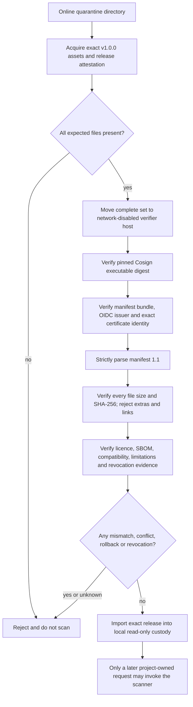
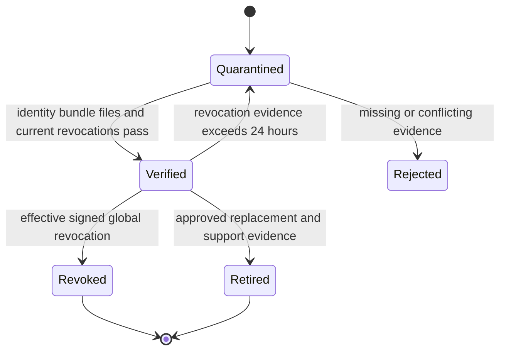

# Offline Release Acquisition and Verification Runbook

This is the operator contract for acquiring and verifying the exact public
scanner release. A release is unusable until every step succeeds. Missing,
stale, conflicting, untrusted or unsupported evidence is a rejection.
Verification never invokes the scanner or reads a candidate repository.
The complete scanner CLI, request payload, outcome payload, exit mapping and
execution state diagrams are in `docs/release/SCANNER-IO-REFERENCE.md` and are
part of the release documentation bundle.

## Fixed trust policy for v1.0.0

| Binding | Required value |
|---|---|
| Repository | `ThameeraDananjaya/project-agnostic-secret-scanner` |
| Repository owner ID | `50274860` |
| Workflow | `.github/workflows/release.yml` |
| Git ref and release | `refs/tags/v1.0.0` and `v1.0.0` |
| OIDC issuer | `https://token.actions.githubusercontent.com` |
| Certificate identity | `https://github.com/ThameeraDananjaya/project-agnostic-secret-scanner/.github/workflows/release.yml@refs/tags/v1.0.0` |
| Manifest schema | `scanner-release-manifest` `1.1` |
| Cosign | `v3.1.3`; Linux amd64 SHA-256 `4629c757b7618056f8ddd7e2625ae9fdd94c0372a65049520bc7d9df9efc7f71`; Windows amd64 SHA-256 `9fe59be0eca1271873ce019061335eb1ac419b7059202e797828467ddabe33be` |

Names do not substitute for numeric identity. The repository ID and observed
workflow claims must also be recorded during the remote preflight because the
repository does not exist at PSCAN-06 local implementation time.

## Trust flow



## Online acquisition

1. Create a new empty quarantine directory. Never reuse a directory that held
   another version.
2. Fetch release `v1.0.0` by exact tag, never `latest`, a branch, an auto-update
   channel or GitHub-generated source archives.
3. Download every asset: manifest, bundle, platform bundles, runners, engines,
   verifiers, rules, schemas, checksums, licences/notices, licence manifest,
   SBOM, test summary, compatibility, limitations, build provenance and
   revocation evidence.
4. Verify the immutable GitHub release attestation and record repository ID,
   tag, commit and asset list. If immutability is disabled or read-back differs,
   stop.
5. Download Cosign only from exact release `v3.1.3` and verify the platform
   SHA-256 above before execution.
6. Copy the complete directory and pinned Cosign executable to a
   network-disabled host. Never copy credentials or repository content there.

```powershell
gh release download v1.0.0 --repo ThameeraDananjaya/project-agnostic-secret-scanner --dir C:\quarantine\pscan-v1.0.0
gh release verify v1.0.0 --repo ThameeraDananjaya/project-agnostic-secret-scanner
```

```bash
gh release download v1.0.0 --repo ThameeraDananjaya/project-agnostic-secret-scanner --dir /quarantine/pscan-v1.0.0
gh release verify v1.0.0 --repo ThameeraDananjaya/project-agnostic-secret-scanner
```

## Offline verifier parameters and output

All five parameters are mandatory in practice; the two relative paths have
fixed defaults.

| Parameter | Type | Meaning and validation |
|---|---|---|
| `--directory` | existing directory | Complete release set. Links, special files, path escape and unexpected files reject. |
| `--manifest` | safe relative path | Default `release-manifest.json`; exact bytes are bundle-verified. |
| `--bundle` | safe relative path | Default `release-manifest.sigstore.json`; absence or mutation rejects. |
| `--cosign` | existing regular file | Absolute path to separately acquired pinned Cosign; links reject. |
| `--cosign-sha256` | 64 lowercase hex | Must equal the platform digest above and current executable bytes. |

```powershell
.\scanner-release-verifier-windows-amd64.exe --directory C:\quarantine\pscan-v1.0.0 --cosign C:\quarantine\tools\cosign-windows-amd64.exe --cosign-sha256 9fe59be0eca1271873ce019061335eb1ac419b7059202e797828467ddabe33be
```

```bash
./scanner-release-verifier-linux-amd64 --directory /quarantine/pscan-v1.0.0 --cosign /quarantine/tools/cosign-linux-amd64 --cosign-sha256 4629c757b7618056f8ddd7e2625ae9fdd94c0372a65049520bc7d9df9efc7f71
```

Success is exactly one content-free line:

```text
verified release=v1.0.0 manifest_sha256=<64 lowercase hex> assets=<decimal count>
```

Exit `0` means verification completed. Exit `40` and the generic stderr message
mean reject. Any other exit, partial output, missing line or manually ignored
warning is not a pass. Output never contains file contents, signatures,
credentials, findings or candidate data.

## Release-manifest 1.1 payload

| Field | Type | Bound meaning |
|---|---|---|
| `schemaFamily`, `manifestSchemaVersion` | strings | Exact family and `1.1`; unknown/duplicate members reject. |
| `releaseVersion` | semver tag | Exact `v1.0.0`; also fixes the ref. |
| `sourceRevision`, `sourceTree` | 40 lowercase hex | Exact committed source and tree. |
| `runnerVersion`, `goToolchainVersion` | versions | Runner `1.0.0` and exact Go patch. |
| `runnerBindings[]` | two platform digests | One Windows amd64 and one Linux amd64 path and SHA-256. |
| `engineBindings[]` | two engine objects | Gitleaks name, version, source commit, platform, path and SHA-256. |
| `rulePack` | path and SHA-256 | Exact generic rule configuration, never project policy. |
| `schemaBindings[]` | family/version/path/digest | Every scanner-owned shipped schema. |
| `releaseIdentity` | identity object | Repository, numeric owner, workflow, tag ref, issuer and certificate URI. |
| `compatibility` | compatibility object | Platforms and bound test-summary/limitation assets. |
| `revocation` | revocation object | Discovery, bootstrap snapshot/checkpoint, schema and 24-hour refresh rule. Discovery is never trusted by transport alone. |
| `assets[]` | asset objects | Safe path, kind, platform, exact length and SHA-256 for every payload. Manifest and bundle are outside the list to avoid a circular digest; the bundle signs the manifest bytes. |
| `createdAt` | UTC timestamp | Deterministic source-commit time, not build wall clock. |

Each asset object is exactly:

```json
{"path":"name","kind":"declared-kind","os":"none|linux|windows","arch":"none|amd64","size":1,"sha256":"64-lowercase-hex"}
```

The checksum file covers prior payloads; the signed manifest binds the checksum
file. This avoids checksum/manifest cycles.

## Revocation, rollback and retirement



- At import, refresh the global revocation chain, accept only signed schema
  `1.1` records in contiguous sequence from the trusted checkpoint, and persist
  the verified head.
- Mutable discovery is navigation only. TLS, HTTP success, release ordering and
  `latest` are never authority. A gap, duplicate, rollback, fork, unknown key,
  invalid signature, stale snapshot or unavailable refresh rejects.
- Effective `scanner-release`, `scanner-asset`, `rule-pack` or `scanner-schema`
  revocation wins over a previous pass.
- For rollback, reacquire an explicitly approved earlier exact version and
  repeat all steps. Never replace files within a verified set.
- For retirement, preserve manifest, bundle, attestations, checksums,
  revocation head and decision evidence. Project cleanup/deployment authority
  remains outside this product.

## Operator record

Record acquisition time; repository numeric ID; immutable-release read-back;
tag/commit; attestation result; every filename/size/hash; Cosign version/hash;
manifest hash; certificate identity/issuer; revocation checkpoint/head and
refresh time; verifier stdout/exit; operator; and final
`ACCEPTED_FOR_LOCAL_CUSTODY` or `REJECTED`. Never record credentials, findings,
candidate bytes, project identity, project policy or receipts here.
