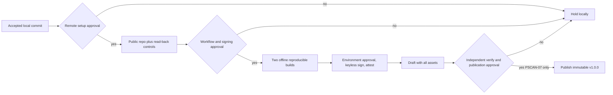

# PSCAN-06 Release Control Plan

Correction C2 uses a separate manual-dispatch recovery workflow, exact product
source and exact correction-tooling identities. Its build job has read-only
contents permission and runs only from proposed tooling tag
`release-tooling-v1.0.0-c2`. Its signing/draft job is skipped unless repository
variable `PSCAN_RELEASE_C2_GATE` exactly equals
`PSCAN-06-C2-SIGNING-APPROVED`, is protected by environment `release-v1`, and
the product source remains locked tag `v1.0.0`, commit
`a13c28fe7273bc8dc6545f97966a02889524eb4c`. Creating the tooling tag or gate
and running the workflow remain separately owner-gated.

Build acquisition accepts only digest-pinned Go/Gitleaks archives and the exact
canonical Docker image repository plus digest. Before any image pull, the
mandatory orchestrator maps the Linux host numeric UID/GID, proves host cache
write, atomic rename, read and delete, proves wrong-owner/read-only rejection,
and executes the fixed host-only CRLF proof. A successful structured engine
response plus an empty exact-reference structured inventory is the only
conclusive-absence state. Inspect errors, stderr text, timeouts, malformed data
and every unknown state stop without a pull. Image admission permits one
explicit pull only for
`docker.io/library/golang@sha256:ded31c68586d2e49e760acc2e65a884b23d032e9bbbed0ae0c55abd3fcaf4452`,
then freshly re-inspects the complete repository-digest set and accepts exactly
one canonical engine identity. Acquisition and image-verification helpers have
no pull capability. Container cache and shell
parser proofs follow with `--pull=never --network none`.

Correction C2 iteration 003 makes the mandatory admission script a closed
entrypoint: dot-sourcing is rejected, it accepts no callback, command runner,
script block, executable or environment-selected implementation, and it runs
the committed host-cache and host-only CRLF prerequisites directly. Docker is
resolved only from the fixed Windows Docker Desktop or Linux `/usr/bin/docker`
location, with Windows publisher-signature or Linux non-mutable-file checks and
a recorded SHA-256. Every exact Docker operation clears the inherited process
environment, uses an argument list, concurrently consumes raw stdout and
stderr, enforces an independent 131072-byte limit per stream, decodes strict
UTF-8 after complete closure, and applies a 15000 ms monotonic budget plus a
fixed 2000 ms cleanup grace. Timeout, overflow, invalid UTF-8, read, exit,
process-tree termination or pipe-closure uncertainty is terminal and cannot be
retried or reclassified as image absence.

Correction C2 iteration 004 extends that boundary to every Docker operation in
the recovery path. `docker-execution.ps1` is the sole Docker process-creation
entrypoint and accepts only a fixed operation name plus operation-specific
typed paths and identities. It constructs the complete engine, inventory,
single-pull, digest-inspection, cache, CRLF, acquisition, build and packaging
argument vectors internally. Admission writes a bounded receipt that fixes the
held executable SHA-256 for every later operation; later phases may re-inspect
but cannot pull again. Each invocation uses a new empty permission-restricted
working, temporary and Docker-config directory, a cleared minimum environment
and a fixed daemon endpoint. Windows starts suspended, assigns the process to a
kill-on-close job, then resumes it. Linux stops a new PID-namespace init before
Docker execution, records its namespace identity, then resumes the held inode
inside that namespace and a private outer session. PID-namespace init death
kernel-terminates detached and nested descendants. A command does not return
trusted evidence until the root, both streams, namespace and containment are
empty. The 131072-byte independent caps, 15000 ms complete budget and 2000 ms
terminal cleanup ceiling remain unchanged.

Correction C2 iteration 005 makes the embedded native implementation exclusive
to each production process. Any existing `PscanNativeBoundary` type is terminal
ambient state and stops the entrypoint before compilation, native dispatch,
private Docker-boundary setup or Docker execution. A clean process always
compiles the one embedded source and verifies that the returned public boundary
and result types are the exact runtime types from the same new assembly. There
is no compatibility inspection, fallback or reuse path. The no-Docker harness
runs its clean matrix, compatible hostile preload and older compatible stale
preload in separate new non-profile PowerShell processes; both hostile processes
must return nonzero with zero fake calls, zero Docker calls and no result.
Iteration 005 changes no Docker operation, image, executable, environment,
containment, stream, time, schema, identity, remote or publication rule.

Independent local review of exact evidence-bearing candidate
`faef8435322c9096df09b56969662411f17356ea`, tree
`3cc6c6234d9cd318792c64ea9e6aa666f146ffb6`, reported no blocking findings and
`LOCAL_ACCEPTANCE_PASS_REMOTE_PROOF_OPEN`. This accepts only iteration 005's
bounded local correction objective. It does not establish actual Linux,
genuine Docker/image/container, dependency-acquisition, complete-build, byte-
comparison or remote proof, and it does not authorize the C2 tooling tag,
workflow run, signing/draft gate, publication or any successor action. PSCAN-06
therefore remains open and unaccepted overall.

## Current governed execution state

As of 2026-09-06, two separately authorized build-only proof-gate attempts have
terminated before remote preflight. The first stopped because its fresh
worktree was detached instead of being the required `main` checkout. Recovery
R1 then used the correct saved-project `main` checkout but stopped because two
tracked PowerShell files had mixed working-tree line endings that failed exact
source trust. Neither attempt made a GitHub request, invoked Docker, dispatched
the workflow, transferred an artifact, signed, attested, drafted or published.

The two working-tree projections were subsequently restored from their exact
committed Git objects. Local post-repair validation passed complete tracked-byte
inspection, all 12 hostile source-trust cases, the synthetic image-admission
matrix and the Windows no-Docker native-boundary matrix with zero Docker calls.
That local validation did not rehabilitate either terminal attempt and grants
no retry authority.

The remaining acceptance work is actual-Linux execution, genuine Docker engine,
image and container evidence, dependency acquisition, two complete builds,
every-byte reproducibility comparison, and workflow/artifact read-back. It
requires a new exact recorded authority and a genuinely fresh execution
session. Signing, attestation, draft creation and publication remain separate
later gates.

Compilation, tests, vet, Windows cross-compilation and two byte-for-byte builds
then run with networking disabled and the module cache read-only. Workflow-
transfer evidence is uncompressed and retained one day; it is not a release.

The gated job verifies Cosign `v3.1.3` by SHA-256, requests one GitHub OIDC
identity, signs schema-`2.1` manifest bytes, and verifies exact repository,
workflow ref, workflow SHA, trigger, certificate identity and issuer against an
explicit authenticated trusted root. It then
creates SBOM-bound GitHub attestations and creates one draft containing every
asset. It has no publish command. Publication needs a separate PSCAN-07 owner
decision after independent acquisition and verification.

Cosign v3.1.3 removed the legacy `--offline` flag. The workflow acquires an
authenticated Sigstore trusted-root document through pinned Cosign/TUF and
passes it explicitly to `verify-blob`. Consumer verification acquires the root
independently online, records its digest, then runs the same bundle verification
inside a network-disabled boundary.

Full action pins:

- `actions/checkout@3d3c42e5aac5ba805825da76410c181273ba90b1`
- `actions/upload-artifact@043fb46d1a93c77aae656e7c1c64a875d1fc6a0a`
- `actions/download-artifact@3e5f45b2cfb9172054b4087a40e8e0b5a5461e7c`
- `actions/attest@1e69f48acb82d1966a394da916b4c1698aa569d6`

The attestation job alone receives `id-token: write`, `attestations: write` and
`artifact-metadata: write`; its draft upload also needs `contents: write`.
These permissions are absent from the build job.

No Gitleaks action, mutable action tag, signing key, stored cloud credential,
larger runner, paid feature, auto-update, TruffleHog material, automatic
publication or consuming-project data is present.
