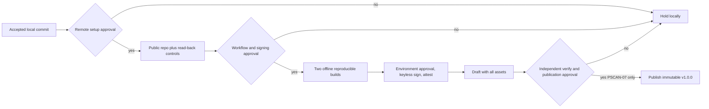

# PSCAN-06 Release Control Plan

Correction C1 uses a separate manual-dispatch recovery workflow, exact product
source and exact correction-tooling identities. Its build job has read-only
contents permission and runs only from proposed tooling tag
`release-tooling-v1.0.0-c1`. Its signing/draft job is skipped unless repository
variable `PSCAN_RELEASE_C1_GATE` exactly equals
`PSCAN-06-C1-SIGNING-APPROVED`, is protected by environment `release-v1`, and
the product source remains locked tag `v1.0.0`, commit
`a13c28fe7273bc8dc6545f97966a02889524eb4c`. Creating the tooling tag or gate
and running the workflow remain separately owner-gated.

Build acquisition accepts only digest-pinned Go/Gitleaks archives and the
full-digest Docker image. Before any dependency download it maps the Linux host
numeric UID/GID and proves cache write, atomic rename, read and delete. The
workflow also proves actual Linux wrong-owner and read-only-cache rejection.
Compilation, tests, vet, Windows cross-compilation and two byte-for-byte builds
then run with networking disabled and the module cache read-only. Workflow-
transfer evidence is uncompressed and retained one day; it is not a release.

The gated job verifies Cosign `v3.1.3` by SHA-256, requests one GitHub OIDC
identity, signs schema-`2.0` manifest bytes, and verifies exact repository,
workflow ref, workflow SHA, trigger, certificate identity and issuer against an
explicit authenticated trusted root. It then
creates SBOM-bound GitHub attestations and creates one draft containing every
asset. It has no publish command. Publication needs a separate PSCAN-07 owner
decision after independent acquisition and verification.

Cosign v3.1.3 removed the legacy `--offline` flag. The workflow acquires an
authenticated Sigstore trusted-root document through pinned Cosign/TUF and
passes it explicitly to `verify-blob`. Consumer verification acquires the root
independently online, records its digest, then runs the same bundle verification
inside a network-disabled boundary.

Full action pins:

- `actions/checkout@3d3c42e5aac5ba805825da76410c181273ba90b1`
- `actions/upload-artifact@043fb46d1a93c77aae656e7c1c64a875d1fc6a0a`
- `actions/download-artifact@3e5f45b2cfb9172054b4087a40e8e0b5a5461e7c`
- `actions/attest@1e69f48acb82d1966a394da916b4c1698aa569d6`

The attestation job alone receives `id-token: write`, `attestations: write` and
`artifact-metadata: write`; its draft upload also needs `contents: write`.
These permissions are absent from the build job.

No Gitleaks action, mutable action tag, signing key, stored cloud credential,
larger runner, paid feature, auto-update, TruffleHog material, automatic
publication or consuming-project data is present.
