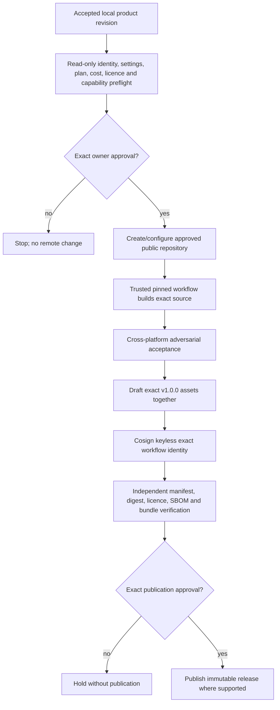

# Release Authority Plan

## Standing direction

- Intended public repository owner: `ThameeraDananjaya`.
- Intended product/repository name: `project-agnostic-secret-scanner`.
- Intended first production-consumable release: signed GitHub `v1.0.0`.
- Product licence: MIT.
- Spending ceiling: zero.
- Release maintainer and final human approver: `ThameeraDananjaya`.
- Signing design: Cosign keyless signing from one exact approved protected
  GitHub release workflow.

These are design defaults, not action authorization.

Correction C1 preserves `v1.0.0` at product-source commit
`a13c28fe7273bc8dc6545f97966a02889524eb4c`. Any recovery must use separately
accepted immutable tooling tag `release-tooling-v1.0.0-c1` and bind its exact
commit, tree, workflow path/ref/SHA and trigger independently from the product
tag/commit/tree. Neither identity may stand in for the other. Creating that tag,
enabling its gate or running the recovery workflow requires a later exact owner
decision.

## Current local authority status

The Correction C1 paragraph above records its original planning boundary. A
2026-09-06 local-only ref inspection found the locked product tag `v1.0.0` at
`a13c28fe7273bc8dc6545f97966a02889524eb4c` and the locked C1 tooling tag
`release-tooling-v1.0.0-c1` at
`3fb7592889820fa2739a4a53588e073689621809`. The proposed C2 tooling tag was
absent locally. No remote ref, repository setting, workflow, run, artifact,
environment, variable, ruleset, release or billing fact was queried, and no
local observation may be promoted to a remote fact.

The original Correction C2 build-only proof gate and Recovery R1 were each
separately authorized, but both terminated before remote preflight. The local
source-trust obstruction found by Recovery R1 has been repaired and revalidated
without Docker or network access. On 2026-09-08 the owner separately authorized
one bounded Recovery R2 attempt. Local Docker cannot prove the required GitHub
workflow, Linux-runner and artifact identities, so Recovery R2 permits only the
exact GitHub-hosted build job, at most one dispatch and maximum spend USD 0.
The approval-session authentication check found an invalid stored GitHub token;
no repository query or mutation followed. A genuinely fresh execution session
may proceed only after re-authentication and a complete current preflight.
Signing, attestation, draft creation and publication remain separately owner-
gated.

## Separation of authorities

| Authority | May do | May not do |
|---|---|---|
| Product owner | Approve publication, legal posture, spend, identity and final release | Convert an unaccepted build into accepted evidence |
| Scanner maintainer | Prepare bounded source and evidence under activated tasks | Publish, sign or change remote controls without action-time approval |
| Release workflow | Build/test/package/sign the exact authorized revision after gates pass | Receive project receipt keys or candidate source from consumers |
| Release approver | Approve exact accepted release invocation | Issue project receipts or approve project deployment |
| Consumer verifier | Acquire and verify exact release into local custody | Trust `latest`, mutable refs or incomplete verification |
| Project receipt issuer | Sign exact project-owned full-release evidence | Use scanner release identity or grant deployment authority |

## Planned release flow

## PSCAN-06 action-time gates

Before any remote creation or settings change, perform a current read-only
preflight of account identity, repository availability, visibility, plan/cost,
Actions, rulesets/protection, immutable releases, artifact attestations, OIDC,
workflow permissions and exact public documentation. Present the exact proposed
changes and any cost. The owner must separately approve the identified action.

PSCAN-01 authorizes none of the following: remote creation, push, PR, settings
change, workflow enablement, signing, credential handling, public artifact,
release or spending.

## Release workflow requirements

- Trusted definition; all third-party actions pinned by full commit SHA.
- Minimal permissions and protected exact workflow/ref identity.
- Clean reproducible build from exact accepted source and pinned toolchain.
- Windows amd64 and Linux amd64 runner plus primary engine assets.
- Generic rules, scanner-owned schemas, release manifest, checksums, bundle,
  SBOM, licences/notices, compatibility, acceptance summary and lifecycle docs.
- Draft-first all-assets-together publication; exact version only; no `latest`.
- Immutable release protection where current verified GitHub capability permits.
- Independent verification of repository, workflow, ref/tag, OIDC issuer,
  manifest signature and every asset before publication.
- Global revocation location, rollback and retirement procedure.

## Separate project boundary

Online acquisition and verification end before network-disabled execution.
Project receipt signing occurs only after a project independently validates the
content-free full-release pass. Receipt credentials are never present in a
scanner execution job. Scanner pass, GitHub check and signed product release do
not approve merge, deployment, production, compliance or go-live.
