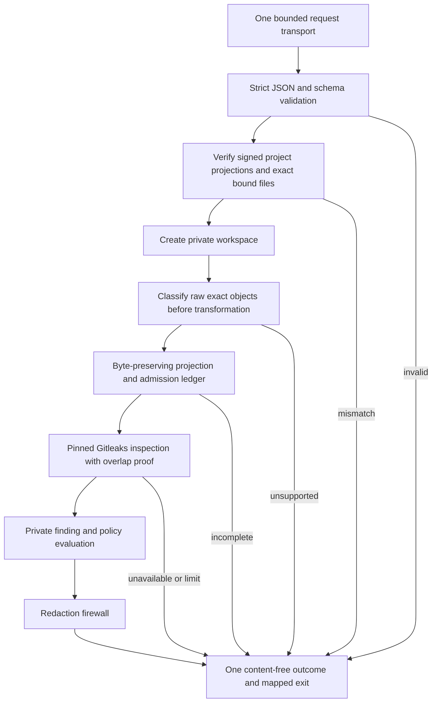
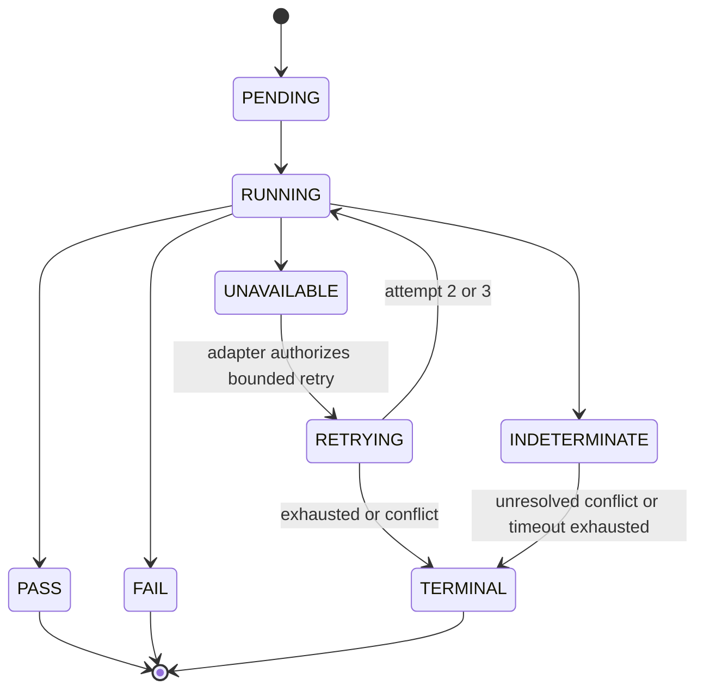

# Scanner Input and Output Reference

This reference describes the scanner-facing interface. It does not authorize a
project scan, policy, receipt, merge or deployment. Examples use synthetic
identities and all-zero illustrative digests; real projects keep their inputs
outside this product repository.

## Invocation parameters

Exactly one request transport is mandatory. Extra positional arguments,
unknown flags, invalid attempts, two transports or no transport fail closed.

| Input | Type/default | Rules | Sensitivity and result on failure |
|---|---|---|---|
| `--request PATH` | local file path; no default | Mutually exclusive with `--request-fd`. Must resolve to a regular local file under safe platform path rules; links/reparse redirection reject. | Project-owned; path and contents never enter public output. Unavailable/unsafe input is non-pass. |
| `--request-fd N` | inherited descriptor; no default | Mutually exclusive with `--request`; minimum `3`; bounded read deadline is five seconds. | Project-owned in-memory transport. Missing/short/stalled input is non-pass. |
| `--workspace-root PATH` | local directory; platform safe default | Must be an approved private local root. Workspace creation uses a unique scan/attempt identity, ownership marker, restrictive permissions and identity recheck before cleanup. | Never public. Unsafe/reused/mismatched root is unavailable or terminal. |
| `--attempt N` | integer, default `1` | `1..3`, supplied by the adapter. A new attempt keeps the same scan ID and records supersession separately. | Public content-free number. Out of range is input-integrity failure. |

There are no interactive prompts and no credential flag. Authoritative scan
execution requires no network and receives no repository token, cloud token,
signing key or receipt key. Build-only variables such as module cache paths are
not scanner inputs. The adapter supplies the exact pinned Gitleaks executable,
rule config and empty ignore file through a private process configuration; the
scanner rechecks their release bindings before use.



## Scan-request 1.1 top-level payload

Unknown or duplicate members reject. All listed fields are required except
those explicitly marked optional. Lowercase SHA-256 means exactly 64 hex
characters; Git OID means 40 or 64 lowercase hex characters; UUID means
lowercase RFC 4122 version 4.

| Field | Type and allowed values | Applicability and binding |
|---|---|---|
| `requestSchemaVersion` | string `1.1` | Required all modes. Unknown major/minor rejects unless a separately signed compatibility rule explicitly supports it. |
| `requiredFeatures` | optional array; currently must be empty | A non-empty or unknown required feature rejects; never silently ignored. |
| `scanId` | UUID v4 | Required unique logical scan identity. |
| `supersedesScanId` | optional UUID v4 | Content-free retry/supersession reference; must be authorized by adapter state. |
| `mode` | `local`, `pr`, `release` | Fixes required source range, manifests and resource profile. |
| `scannerReleaseDigest` | lowercase SHA-256 | Exact accepted signed scanner release. |
| `engineBinding` | object below | Exact Gitleaks binary and adapter. |
| `rulePackDigest` | SHA-256 | Exact generic scanner-owned rules. It is not project policy. |
| `policyDigest`, `allowlistDigest` | SHA-256 each | Exact project-owned raw documents. |
| `policyBinding`, `allowlistBinding` | signed binding objects below | Exact signed, deterministic projections. |
| `proofBindings` | proof object below | Exact admission, classifier, preparation, resource-profile and inspection-proof identities. |
| `sourceBinding` | source object below | Exact Git range/tree facts. |
| `trackedSourceManifest` | file binding | Complete regular-file head-tree projection. |
| `buildContextManifest` | optional file binding; required in `release` | Exact build-context projection. |
| `artifactManifest` | optional object; required in `release` | Exact frozen artifact set. |
| `fallbackRequirement` | object `{ "mode": "disabled" }` | Fallback that can skip required coverage is never enabled. |
| `limits` | bounded object below | Requested values may only narrow the declared mode profile, never expand it. |
| `offlineRequired` | boolean; must be `true` for `pr`/`release` | Any network-capable authoritative PR/release scan rejects. |
| `redactionMode` | string `full` | No partial, debug or verbose redaction mode exists. |
| `requestedAt` | canonical UTC RFC 3339 ending `Z` | Freshness is validated against adapter time; future/stale values reject. |

### Nested objects

`engineBinding` requires `name: "gitleaks"`, a token `version`, the exact
`binaryDigest`, and token `adapterVersion`. Tokens are 1–64 safe
alphanumeric/period/underscore/plus/hyphen characters.

Each project document binding requires `schemaFamily`, `schemaVersion`,
`adapterVersion`, `digest` and `signature`. A signature contains
`trustDomain` (`project-policy` or `project-allowlist` as appropriate),
`algorithm: "ed25519"`, safe `keyId`, and an 86-character unpadded base64url
signature. Policy/allowlist domains are not interchangeable. The project owns
keys and raw documents; this repository stores neither.

`proofBindings` requires:

| Field | Type | Meaning |
|---|---|---|
| `admissionLedgerSchemaVersion`, `admissionLedgerDigest` | `major.minor`, SHA-256 | Exact private row format and complete ledger bytes. |
| `rawClassifierVersion`, `rawClassifierDigest` | token, SHA-256 | Classifier executable/rule identity applied before transformation. |
| `preparationVersion`, `preparationDigest` | token, SHA-256 | Exact projection/framing algorithm. |
| `resourceProfileId` | token | Declared bounded `pr` or `release` profile; exceeding it is non-pass. |
| `inspectionProofFormat`, `inspectionProofDigest` | token, SHA-256 | Proof that every admitted byte reached detector inspection under the pinned maximum span. |

`sourceBinding` always requires `headCommit`, `historyRangeDigest` and
`trackedTreeDigest`. `pr` additionally requires `baseCommit` and `mergeBase`.
`release` requires `firstRelease`; `true` forbids `baseCommit`, while `false`
requires the previous accepted boundary. Any contradictory/missing identity
rejects before detector invocation.

A file binding is exactly `{ "path": "safe-local-path", "digest":
"sha256" }`. The path is project-local and platform-normalized only for access;
the exact admitted bytes remain digest authority. File links, devices, pipes,
reparse points and post-validation replacement reject.

`artifactManifest` requires a manifest `digest` and `entries[]`. Each entry
requires project-relative `path`, classifier `type`, non-negative byte `size`
and exact `digest`. Duplicate paths, unsupported/raw-ambiguous types, missing
entries, extra admitted artifacts, total mismatch or normalization loss is
non-pass.

`limits` has these hard maxima: `timeoutSeconds` 3600 (900 in PR),
`maxArchiveDepth` 5, `maxArchiveEntries` 100000, `maxExpandedBytes` 10 GiB
(2 GiB in PR), `maxFileBytes` 512 MiB, `maxCompressionRatio` 1000,
`maxCpuPercent` 100, and positive `maxMemoryBytes` bounded by the declared
profile (4 GiB PR, 8 GiB release). Minimum for each is 1. The product owner may
change release profiles only through a new accepted release; a project request
may narrow but not expand them.

Minimal shape example (digests are deliberately synthetic and not usable):

```json
{
  "requestSchemaVersion":"1.1",
  "scanId":"00000000-0000-4000-8000-000000000001",
  "mode":"local",
  "scannerReleaseDigest":"0000000000000000000000000000000000000000000000000000000000000000",
  "engineBinding":{"name":"gitleaks","version":"8.30.1","binaryDigest":"0000000000000000000000000000000000000000000000000000000000000000","adapterVersion":"2.0.0"},
  "rulePackDigest":"0000000000000000000000000000000000000000000000000000000000000000",
  "policyDigest":"0000000000000000000000000000000000000000000000000000000000000000",
  "allowlistDigest":"0000000000000000000000000000000000000000000000000000000000000000",
  "policyBinding":{"schemaFamily":"synthetic-policy","schemaVersion":"1.0","adapterVersion":"projection-1.0","digest":"0000000000000000000000000000000000000000000000000000000000000000","signature":{"trustDomain":"project-policy","algorithm":"ed25519","keyId":"synthetic-key","value":"AAAAAAAAAAAAAAAAAAAAAAAAAAAAAAAAAAAAAAAAAAAAAAAAAAAAAAAAAAAAAAAAAAAAAAAAAAAAAAAAAAAAAA"}},
  "allowlistBinding":{"schemaFamily":"synthetic-allowlist","schemaVersion":"1.0","adapterVersion":"projection-1.0","digest":"0000000000000000000000000000000000000000000000000000000000000000","signature":{"trustDomain":"project-allowlist","algorithm":"ed25519","keyId":"synthetic-key","value":"AAAAAAAAAAAAAAAAAAAAAAAAAAAAAAAAAAAAAAAAAAAAAAAAAAAAAAAAAAAAAAAAAAAAAAAAAAAAAAAAAAAAAA"}},
  "proofBindings":{"admissionLedgerSchemaVersion":"1.0","admissionLedgerDigest":"0000000000000000000000000000000000000000000000000000000000000000","rawClassifierVersion":"1.0","rawClassifierDigest":"0000000000000000000000000000000000000000000000000000000000000000","preparationVersion":"1.0","preparationDigest":"0000000000000000000000000000000000000000000000000000000000000000","resourceProfileId":"local-bounded-1","inspectionProofFormat":"1.0","inspectionProofDigest":"0000000000000000000000000000000000000000000000000000000000000000"},
  "sourceBinding":{"headCommit":"0000000000000000000000000000000000000000","historyRangeDigest":"0000000000000000000000000000000000000000000000000000000000000000","trackedTreeDigest":"0000000000000000000000000000000000000000000000000000000000000000"},
  "trackedSourceManifest":{"path":"synthetic-tracked.json","digest":"0000000000000000000000000000000000000000000000000000000000000000"},
  "fallbackRequirement":{"mode":"disabled"},
  "limits":{"timeoutSeconds":60,"maxArchiveDepth":1,"maxArchiveEntries":1,"maxExpandedBytes":1,"maxFileBytes":1,"maxCompressionRatio":1,"maxMemoryBytes":1,"maxCpuPercent":1},
  "offlineRequired":true,
  "redactionMode":"full",
  "requestedAt":"2026-09-03T00:00:00Z"
}
```

The example is intentionally invalid as evidence: zero digests/signatures do
not bind trusted objects. It illustrates syntax only.

## Scan-outcome 1.0 payload and process output

Stdout contains exactly one JSON object and one trailing newline. Stderr is a
bounded generic diagnostic. Findings, counts, paths, locations, authors,
excerpts, fingerprints, rule/provider details, allowlist details, annotations,
SARIF, progress, colour and interactive output are forbidden.

| Field | Type and applicability |
|---|---|
| `outcomeSchemaVersion` | Always string `1.0`. |
| `scanId`, `supersedesScanId` | Required scan UUID and optional superseded UUID. |
| `mode` | `local`, `pr`, `release`, or `unknown` only for safe pre-parse failure. |
| `state` | `PENDING`, `RUNNING`, `PASS`, `FAIL`, `INDETERMINATE`, `UNAVAILABLE`, `RETRYING`, `TERMINAL`. Terminal CLI output is normally one of the five final categories. |
| `reasonCode` | Required for final states, absent for pending/running/retrying. `PASS_NO_BLOCKING_FINDINGS`; `FAIL_*`; `INDETERMINATE_*`; `UNAVAILABLE_*`; or `TERMINAL_*` per schema. |
| `bindings` | Present after trustworthy request binding; echoes only approved exact digests/versions and Git proof identities, never project content. |
| `attemptNumber` | Integer `1..3`. |
| `startedAt`, `endedAt`, `durationMillis` | UTC timestamps and non-negative elapsed milliseconds. |
| `coverageClasses` | Unique content-free completed class names. Absence of a required class prevents pass. |
| `permittedAction` | `VERIFY_OTHER_GATES`, `CREATE_CORRECTED_CANDIDATE`, `DIAGNOSE_INPUT`, `RETRY_IF_ELIGIBLE`, `WAIT`, or `STOP_AND_ESCALATE`, fixed by state. |

`bindings` contains scanner release, engine name/version/binary, adapter, rule,
policy, allowlist and request-schema identities; source base/head/merge-base;
history/tree/tracked-manifest identities; and optional build-context/artifact
manifest identities. Fields are content-free but can still be project-owned
metadata and belong only in the consuming project's evidence store.

Exit mapping is fixed: `0` pass, `10` fail, `20` indeterminate, `30`
unavailable, `40` terminal/internal invariant. A nonzero exit can never be
overridden by a partial JSON object. Exit `0` is only scanner evidence and
still requires every independent project gate.



Cleanup failure, redaction uncertainty, retry exhaustion or contradictory
evidence is terminal. Operators preserve content-free evidence, quarantine the
release/request, stop promotion and escalate to the applicable product or
project owner. They never paste suspected secret text into logs or issues.
